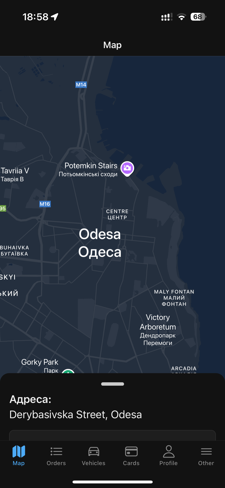
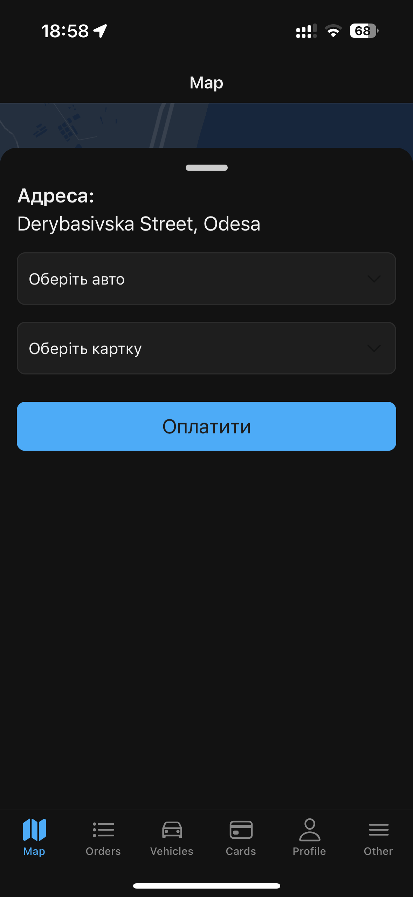
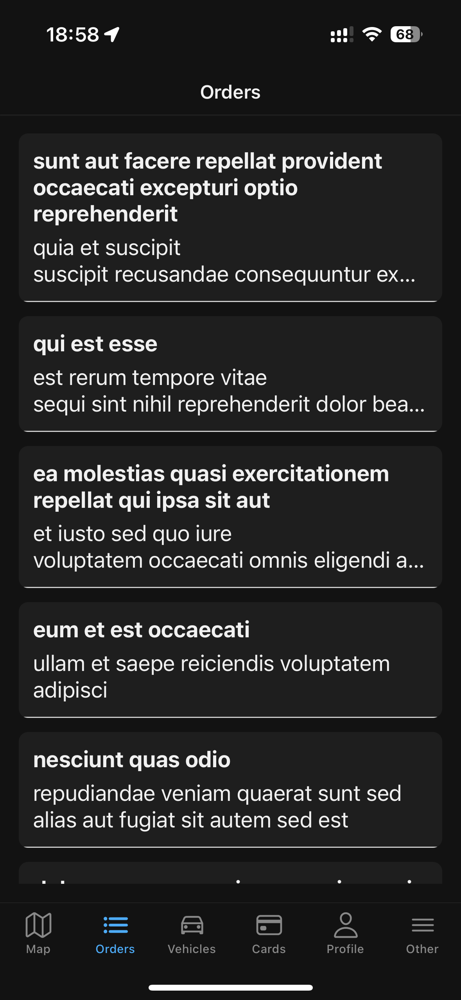
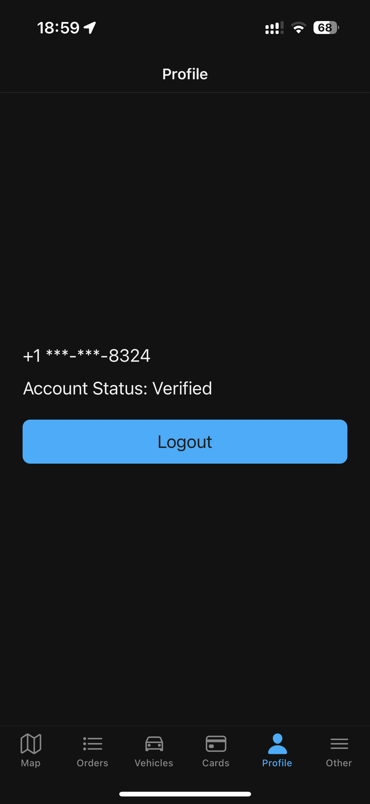
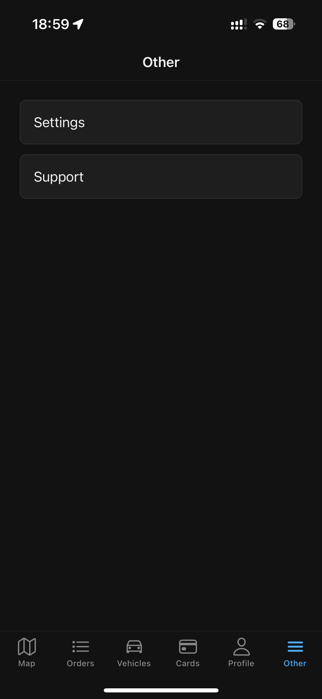
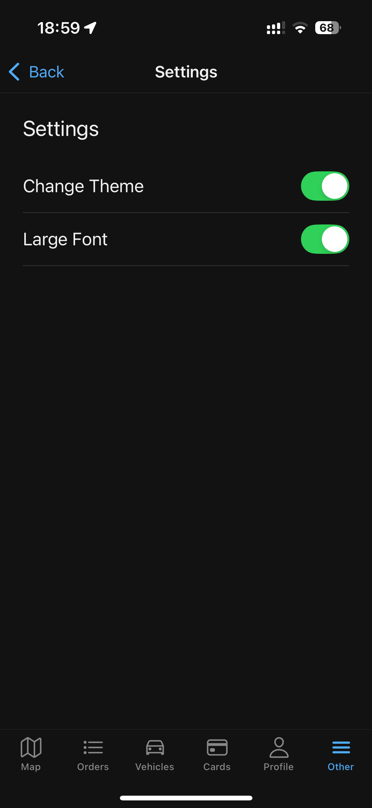

# 🚗 Parking App – React Native

Цей мобільний застосунок дозволяє користувачам швидко знаходити паркомісця на мапі, обирати автомобіль і кредитну картку для оплати, а також інтерактивно взаємодіяти з UI через панель, що з’являється знизу.

---

## 🧩 Завдання 1. Аналіз наявного застосунку

### 🔑 Ключові функції:
- Визначення поточної геолокації користувача.
- Відображення мапи з позначкою “Ви тут”.
- Можливість натискання на будь-яку точку мапи.
- Інтеграція з `react-navigation` для переходів між екранами.
- Контексти для теми (`light`/`dark`) та шрифтів (`normal`/`large`).

### 📲 Сценарії використання:
- Користувач відкриває застосунок → бачить мапу → обирає місце → обирає авто, карту → натискає "Pay".
- Перехід між вкладками: Map, Orders, Vehicles, Cards, Profile тощо.

### 🔧 Зони для розширення функціональності:
1. **Інтерактивна панель знизу** — при натисканні на мапу відкривається вікно з деталями.
2. **Вибір авто/картки/годин** — додання дропдаунів для вибору.
3. **Покращення теми та шрифтів** — синхронізація стилів з глобальним Context API.
4. **Інтеграція API** — отримання вільних місць паркування та ордерів.

---

## 🧪 Завдання 2. Розширення функціоналу

### ✅ Додано нову функціональність:

**Інтерактивна панель (BottomSheet / Animated View):**
- При натисканні на будь-яке місце на мапі відкривається вікно з адресою.
- Вікно можна розгорнути свайпом догори або згорнути вниз.
- Інтегровано drag handle.

**Нові інтерактивні елементи:**
- Вибір автомобіля.
- Вибір кредитної картки.
- Кнопка "Pay" з динамічною сумою (`години * ціна`).

### 🧠 Керування станом:

- **Context API** використано для:
  - Теми (`ThemeContext`) — світла/темна тема.
  - Шрифтів (`FontContext`) — великий/звичайний текст.

**Обґрунтування:** Context API добре підходить для UI-параметрів, які змінюються глобально без необхідності централізованого стану (на відміну від Redux).

### 🧱 Компонентний підхід:

- `ThemedText` — компонент для автоматичної підтримки теми та розміру шрифту.
- Панель реалізовано як **Animated.View** з кастомним свайпом.
- Всі частини виносяться в окремі компоненти/контексти:
  - `ThemeContext.js`
  - `FontContext.js`
  - `ThemedText.js`

---

## 🎨 Завдання 3. Вдосконалення користувацького досвіду (UX/UI)

- Інтерактивна панель має drag handle і анімації для кращої взаємодії.
- Всі дропдауни (`DropDownPicker`) стилізовані відповідно до теми.
- Кнопка “Pay” також змінює стиль відповідно до теми.
- Шрифти автоматично підлаштовуються під вибраний розмір.
- Зрозуміла навігація між екранами за допомогою `@react-navigation`.

---

## 📄 Завдання 4. Документація та презентація

### 📝 Короткий опис змін:
- Реалізовано нову функцію — панель, що з’являється при натисканні на карту.
- Додано вибір авто/картки/тривалості та кнопку оплати.
- Синхронізовано тему та шрифт з глобальним Context API.
- Компоненти винесено в окремі файли.

### 📸 Скріншоти:
- 
- 
- 
- 
- 
- 
- 

### 🎤 Презентація:
- **Основна ідея**: додати гнучку, анімовану панель з інформацією для швидкої оплати паркування.
- **Ключові нововведення**:
  - Динамічна панель.
  - Інтерактивні дропдауни.
  - Темізація та масштабування тексту.
- **Структура проєкту**:
  - Context API для глобального стану.
  - Компонентна структура для модульності та повторного використання.

---

🔗 **Проєкт реалізовано з використанням:**
- `React Native`, `Expo`
- `react-native-maps`
- `DropDownPicker`
- `Animated`, `PanResponder`
- `Context API` для теми та шрифтів
- `react-navigation` для маршрутизації


---

## Встановлення та запуск

```bash
git clone https://github.com/yourname/parking-app.git
cd parking-app
npm install
npx expo start
