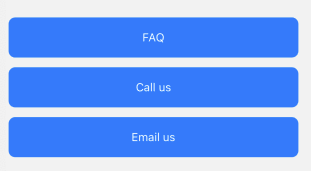
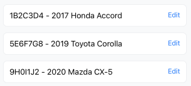

# Parking App (React Native + Expo)

Мобільний додаток для оплати паркування з підтримкою карти, замовлень, автомобілів, карток та профілю користувача. Реалізовано на Expo (React Native) з навігацією та стилями.

---

## 🧩 Основні компоненти

### 🔘 1. CustomButton

Кнопка з динамічним заголовком та кастомним стилем.



> Компонент: `components/CustomButton.jsx`  
> Пропси: `title`, `onPress`

---

### 🚗 2. VehicleCard

Картка з номером авто та моделлю, а також кнопкою "Edit".



> Компонент: `components/VehicleCard.jsx`  
> Пропси: `plate`, `model`, `onEdit`

---

### 📋 3. OrdersScreen (FlatList)

Список замовлень користувача з датою, адресою та сумою.

> Екран: `screens/OrdersScreen.jsx`  
> Кожен елемент — картка замовлення, реалізована у FlatList.

---

### 🗺️ 4. MapScreen

Екран із Map та геопозицією користувача (через `expo-location` та `react-native-maps`).

> Екран: `screens/MapScreen.jsx`  
> Показує карту з маркером поточної позиції.

---

### 🧾 5. CreditCardsScreen

Простий placeholder-екран для майбутньої роботи з банківськими картками.

---

### 👤 6. ProfileScreen

Профіль користувача з телефоном, статусом та кнопкою "Logout".

---

### 📦 7. Навігація (Tab + Stack)

Поєднання `Tab.Navigator` і `Stack.Navigator` для перемикання між основними екранами та деталями.


> Файл: `navigation/AppNavigator.jsx`

---

## 🎨 Динамічна тема та шрифт

У додатку реалізовано підтримку **темної/світлої теми** та **змінного розміру шрифту**.

- Теми зберігаються в `ThemeContext` (файл: `context/ThemeContext.js`)
- Розміри шрифтів — у `FontContext` (файл: `context/FontContext.js`)
- Теми зчитуються з `COLORS` у `constants/colors.js`, де вказані кольори для `light` і `dark`
- Усі компоненти (`ThemedText`, `ThemedView`, `CustomButton`, тощо) автоматично реагують на зміну теми й шрифту
- Зміна відбувається на екрані `SettingsScreen` через `Switch`

> 🔁 Налаштування теми та шрифтів працює глобально — зміни застосовуються до всіх сторінок і компонентів без перезавантаження.

---

## 📱 Адаптивність

- Використовується `useWindowDimensions()` для обчислення ширини/висоти
- Компоненти адаптовані під `portrait` і `landscape`
- Можна повертати екран і компоненти адаптуються до нової орієнтації

---

## 🧪 Встановлення та запуск

```bash
git clone https://github.com/yourname/parking-app.git
cd parking-app
npm install
npx expo start


## Аналіз застосунку

1. Компонент з потребою в анімації
Компонент: VehicleCard
Сценарій: При натисканні "Edit" з'являється форма редагування транспортного засобу → потребує анімації розгортання/згортання.

2. Компонент, що часто оновлюється
Компонент: OrdersScreen (FlatList)
Проблема: Велика кількість елементів + можливі state-зміни → повторні ререндери елементів.

3. Великі залежності в package.json
"react-native-maps": "^1.20.1" - велика вага
